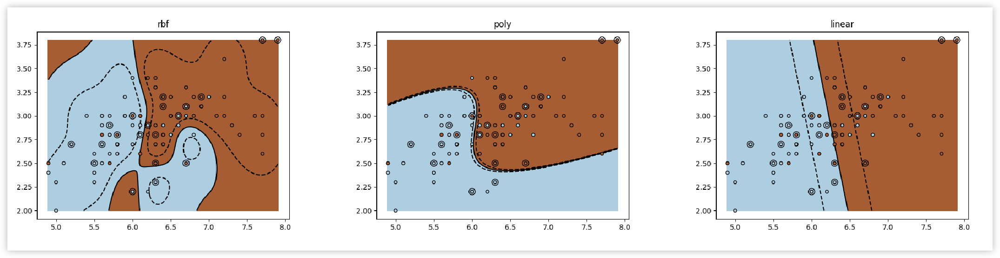

# Guild AI start
[Guild AI](https://github.com/guildai/guildai) is an open source toolkit that automates and optimizes machine learning experiments.

This project was created by following the Guild AI [Get Started](https://my.guild.ai/t/get-started-with-guild-ai/35) guide.

### Development
1. Install Guild AI `pip install guildai`
2. Initialize the environment `guild init`
3. View available operations `guild ops`

### Example: SVM Classifier ([source](https://my.guild.ai/t/get-started-add-a-classifier/47#train-the-classifier-8))
1. Train the classifier `guild run iris-svm:train kernel='[linear,poly,rbf]'`
2. Compare results visually `guild tensorboard --tab images`
